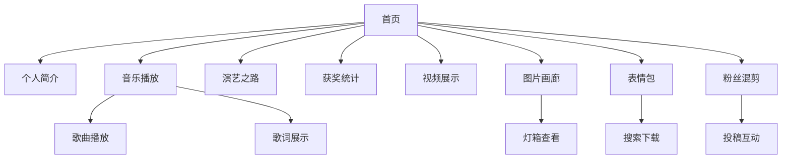

## 1. 产品概述
周深个人简介网站是一个专为歌手周深打造的响应式单页应用，采用苹果液态玻璃设计风格，为粉丝提供全方位的艺人信息展示平台。

该网站解决了粉丝获取周深最新动态、作品欣赏、演出信息的需求，通过现代化的交互设计和丰富的多媒体内容，为粉丝提供沉浸式的浏览体验。

## 2. 核心功能

### 2.1 用户角色
| 角色 | 注册方式 | 核心权限 |
|------|----------|----------|
| 普通访客 | 无需注册 | 浏览所有内容、播放音乐、观看视频 |
| 粉丝用户 | 邮箱注册 | 点赞互动、收藏内容、参与评论 |
| 管理员 | 后台创建 | 内容管理、数据更新、用户管理 |

### 2.2 功能模块
网站包含以下核心页面：
1. **首页**：导航菜单、英雄区域、模块入口
2. **个人简介页**：艺人信息、出道历程、艺术特色
3. **音乐播放页**：歌曲列表、音频播放器、歌词展示
4. **演艺之路页**：时间线展示、重要演出记录
5. **获奖统计页**：数据可视化、奖项筛选
6. **视频展示页**：近期视频、网格布局
7. **图片画廊页**：瀑布流布局、分类浏览、灯箱查看
8. **表情包页**：搜索功能、一键下载
9. **粉丝混剪页**：精选视频、投稿入口、点赞功能

### 2.3 页面详情
| 页面名称 | 模块名称 | 功能描述 |
|----------|----------|----------|
| 首页 | 导航菜单 | 提供平滑滚动导航，支持锚点定位到各功能模块 |
| 首页 | 英雄区域 | 展示周深主视觉形象，配合液态玻璃背景效果 |
| 个人简介页 | 基本信息 | 展示艺人档案、出道时间、代表作品等核心信息 |
| 个人简介页 | 出道历程 | 时间轴式展示从出道至今的重要发展节点 |
| 个人简介页 | 艺术特色 | 介绍独特的声线特点、音乐风格和演唱技巧 |
| 音乐播放页 | 歌曲列表 | 展示周深代表作品，支持分类和搜索 |
| 音乐播放页 | 音频播放器 | 集成播放控制、进度条、音量调节、循环模式 |
| 音乐播放页 | 歌词展示 | 实时同步显示歌词，支持滚动和字体大小调节 |
| 演艺之路页 | 时间线 | 可视化展示重要演出、综艺、演唱会等里程碑 |
| 获奖统计页 | 数据图表 | 使用图表展示各类奖项统计，支持年份筛选 |
| 视频展示页 | 视频网格 | 嵌入B站/YouTube视频，支持悬停预览 |
| 图片画廊页 | 瀑布流布局 | 自适应网格展示高清图片，支持分类筛选 |
| 图片画廊页 | 灯箱查看 | 点击图片放大查看，支持左右切换 |
| 表情包页 | 搜索功能 | 关键词搜索表情包，支持标签分类 |
| 表情包页 | 下载功能 | 一键下载表情包到本地 |
| 粉丝混剪页 | 视频展示 | 展示精选粉丝创作视频 |
| 粉丝混剪页 | 互动功能 | 支持点赞、投稿入口 |

## 3. 核心流程
用户访问流程：
1. 用户进入首页，浏览英雄区域和导航菜单
2. 通过导航菜单或滚动浏览，访问各个功能模块
3. 在音乐播放页试听歌曲，查看歌词
4. 在演艺之路页查看发展历程
5. 在获奖统计页查看荣誉成就
6. 浏览视频、图片、表情包等多媒体内容
7. 粉丝用户可进行点赞、收藏等互动操作

## 4. 用户界面设计

### 4.1 设计风格
- **主色调**：海蓝色渐变体系（#00B4D8到#0077B6）
- **背景**：液态玻璃效果，使用backdrop-filter实现毛玻璃质感
- **按钮样式**：圆角矩形，渐变背景，悬停时有光晕效果
- **字体**：主标题使用思源黑体，正文字体使用苹方，字号14-16px
- **布局风格**：卡片式布局，模块间使用渐变分割线
- **图标风格**：线性图标，配合微动画效果

### 4.2 页面设计概览
| 页面名称 | 模块名称 | UI元素 |
|----------|----------|--------|
| 首页 | 英雄区域 | 全屏背景图配合液态玻璃卡片，主标题使用48px大字体，渐变色彩 |
| 个人简介页 | 时间轴 | 垂直时间线，节点使用圆形图标，卡片采用半透明玻璃效果 |
| 音乐播放页 | 播放器 | 底部固定播放条，专辑封面使用圆形设计，进度条带渐变 |
| 演艺之路页 | 时间线 | 水平时间轴，重要节点放大显示，悬停显示详细信息 |
| 获奖统计页 | 图表 | 使用Chart.js实现，配色与主色调保持一致 |
| 视频展示页 | 视频卡片 | 网格布局，悬停时显示播放按钮和简介 |
| 图片画廊页 | 瀑布流 | Pinterest式布局，图片懒加载，灯箱使用黑色半透明背景 |
| 表情包页 | 搜索栏 | 顶部搜索框，支持实时搜索，结果网格展示 |

### 4.3 响应式设计
- **桌面优先**：默认设计为1920px宽屏显示
- **移动端适配**：支持768px和375px断点
- **触摸优化**：移动端增加触摸滑动支持，按钮增大点击区域
- **性能优化**：图片使用WebP格式，实现懒加载

### 4.4 性能要求
- **帧率**：所有动画效果保持60fps
- **加载时间**：首屏加载控制在3秒内
- **SEO**：支持预渲染，meta标签完整
- **兼容性**：支持Chrome、Firefox、Safari、Edge最新两个版本