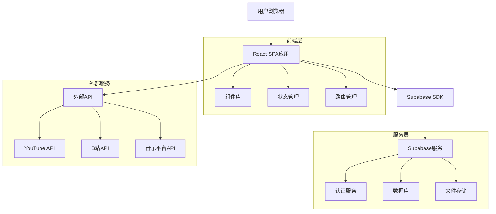
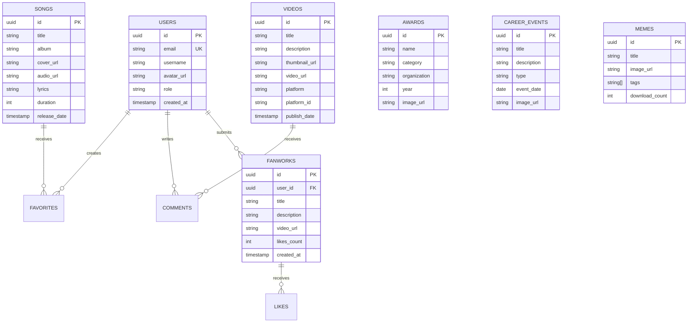

## 1. 架构设计



## 2. 技术栈描述

- **前端框架**: React@18 + TypeScript + Vite
- **初始化工具**: vite-init
- **样式方案**: TailwindCSS@3 + 自定义CSS变量
- **状态管理**: Zustand
- **路由管理**: React Router@6
- **UI组件库**: HeadlessUI + RadixUI
- **动画库**: Framer Motion
- **数据可视化**: Chart.js + react-chartjs-2
- **音频播放**: Howler.js
- **图片处理**: react-lazyload + react-image-gallery
- **后端服务**: Supabase
- **部署平台**: Vercel/Netlify

## 3. 路由定义

| 路由路径 | 页面用途 |
|----------|----------|
| / | 首页，展示导航和英雄区域 |
| /profile | 个人简介页，艺人信息和出道历程 |
| /music | 音乐播放页，歌曲列表和播放器 |
| /career | 演艺之路页，时间线展示 |
| /awards | 获奖统计页，数据可视化 |
| /videos | 视频展示页，近期视频内容 |
| /gallery | 图片画廊页，瀑布流图片展示 |
| /memes | 表情包页，搜索和下载功能 |
| /fanworks | 粉丝混剪页，投稿和互动 |

## 4. 数据模型

### 4.1 数据库实体关系图



### 4.2 数据定义语言

用户表 (users)
```sql
CREATE TABLE users (
  id UUID PRIMARY KEY DEFAULT gen_random_uuid(),
  email VARCHAR(255) UNIQUE NOT NULL,
  username VARCHAR(50) NOT NULL,
  avatar_url TEXT,
  role VARCHAR(20) DEFAULT 'user' CHECK (role IN ('user', 'admin')),
  created_at TIMESTAMP WITH TIME ZONE DEFAULT NOW()
);

-- 创建索引
CREATE INDEX idx_users_email ON users(email);
CREATE INDEX idx_users_username ON users(username);
```

歌曲表 (songs)
```sql
CREATE TABLE songs (
  id UUID PRIMARY KEY DEFAULT gen_random_uuid(),
  title VARCHAR(255) NOT NULL,
  album VARCHAR(255),
  cover_url TEXT NOT NULL,
  audio_url TEXT NOT NULL,
  lyrics TEXT,
  duration INTEGER,
  release_date DATE,
  created_at TIMESTAMP WITH TIME ZONE DEFAULT NOW()
);

-- 创建索引
CREATE INDEX idx_songs_title ON songs(title);
CREATE INDEX idx_songs_release_date ON songs(release_date DESC);
```

视频表 (videos)
```sql
CREATE TABLE videos (
  id UUID PRIMARY KEY DEFAULT gen_random_uuid(),
  title VARCHAR(255) NOT NULL,
  description TEXT,
  thumbnail_url TEXT NOT NULL,
  video_url TEXT NOT NULL,
  platform VARCHAR(50) NOT NULL,
  platform_id VARCHAR(100),
  publish_date TIMESTAMP,
  created_at TIMESTAMP WITH TIME ZONE DEFAULT NOW()
);

-- 创建索引
CREATE INDEX idx_videos_publish_date ON videos(publish_date DESC);
CREATE INDEX idx_videos_platform ON videos(platform);
```

### 4.3 Supabase访问权限

```sql
-- 基础访问权限
GRANT SELECT ON users TO anon;
GRANT SELECT ON songs TO anon;
GRANT SELECT ON videos TO anon;
GRANT SELECT ON awards TO anon;
GRANT SELECT ON career_events TO anon;
GRANT SELECT ON memes TO anon;
GRANT SELECT ON fanworks TO anon;

-- 认证用户权限
GRANT ALL PRIVILEGES ON users TO authenticated;
GRANT ALL PRIVILEGES ON favorites TO authenticated;
GRANT ALL PRIVILEGES ON comments TO authenticated;
GRANT ALL PRIVILEGES ON likes TO authenticated;
GRANT ALL PRIVILEGES ON fanworks TO authenticated;

-- RLS策略示例
ALTER TABLE fanworks ENABLE ROW LEVEL SECURITY;
CREATE POLICY "Users can insert their own fanworks" ON fanworks
  FOR INSERT WITH CHECK (auth.uid() = user_id);
```

## 5. 组件架构

### 5.1 核心组件结构

```
src/
├── components/
│   ├── common/
│   │   ├── Header.tsx          # 顶部导航
│   │   ├── Footer.tsx          # 底部信息
│   │   ├── GlassCard.tsx       # 液态玻璃卡片
│   │   └── LazyImage.tsx       # 懒加载图片
│   ├── music/
│   │   ├── AudioPlayer.tsx     # 音频播放器
│   │   ├── SongList.tsx        # 歌曲列表
│   │   └── LyricsDisplay.tsx   # 歌词展示
│   ├── profile/
│   │   ├── Timeline.tsx        # 时间轴组件
│   │   └── InfoCard.tsx        # 信息卡片
│   ├── gallery/
│   │   ├── MasonryGrid.tsx     # 瀑布流布局
│   │   └── Lightbox.tsx        # 灯箱组件
│   └── charts/
│       └── AwardChart.tsx      # 获奖统计图表
├── hooks/
│   ├── useAudio.ts             # 音频播放逻辑
│   ├── useIntersection.ts      # 懒加载钩子
│   └── useResponsive.ts      # 响应式钩子
├── stores/
│   ├── musicStore.ts           # 音乐状态管理
│   └── userStore.ts            # 用户状态管理
└── utils/
    ├── api.ts                  # API封装
    ├── constants.ts            # 常量定义
    └── helpers.ts              # 工具函数
```

### 5.2 性能优化策略

1. **代码分割**: 按路由和组件进行代码分割
2. **图片优化**: WebP格式，多尺寸适配，懒加载
3. **缓存策略**: 浏览器缓存 + Service Worker
4. **预加载**: 关键资源预加载，路由预加载
5. **虚拟滚动**: 长列表使用虚拟滚动优化

### 5.3 SEO优化

1. **预渲染**: 使用react-snap进行静态预渲染
2. **Meta标签**: 动态生成页面meta信息
3. **结构化数据**: 添加JSON-LD结构化数据
4. **Sitemap**: 自动生成网站地图
5. **OpenGraph**: 支持社交媒体分享预览